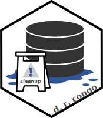

Cleanup : DRC 
====================================================================================================

<!-- badges: start -->

 <!--badges: end -->

Context
----------------------------------------------------------------------------------------------------
This package contains clean up code for a variety of datasets used in the DRC. These include the following data sources :
- [ ] IDS (national surveillance of a large number of maladies) 
- [ ] INRB
    - [ ] Measles
    - [ ] Monkeypox
    - [ ] Yellow Fever
- [ ] DHIS2
    - [ ] Malnutrition

These data are cleaned with the following objectives in mind :
- [ ] Identify and eliminate duplicates (fuzzy included)
- [ ] Remove obviously corrupt entries (ex. dates in the future)
- [ ] Reconstruct dates based on ISO week 
- [ ] Conform to ASCI
- [ ] Use GIS spellings consistent with the `epiplaces` package
- [ ] Use standardized and sane headers

In the future, this package will also include data quality checks and cleaning logs.

